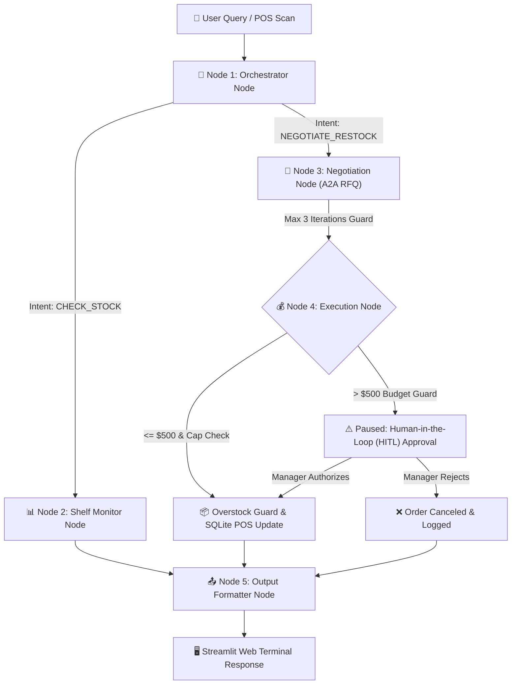

# 🌿 VeganFlow: Autonomous Multi-Agent Supply Chain & Retail Intelligence Matrix

[](https://www.python.org/)
[](https://github.com/langchain-ai/langgraph)
[](https://ollama.ai/)
[](https://streamlit.io/)
[](https://www.sqlite.org/)
[-success?style=for-the-badge)](evals.py)

---

## 🎯 Recommended Project Name & Subtitle

- **Primary Title:** `VeganFlow`
- **Subtitle / Tagline:** *Autonomous Multi-Agent Supply Chain Orchestration & Layered Guardrails System*

---

## 📌 Problem Statement & Real-World Impact

Modern retail supply chains face three major operational bottlenecks:

1. **Undetected Stockout & Expiry Risks:** Manual inventory monitoring fails to catch fast-moving SKUs before they run out, causing lost sales and customer dissatisfaction. Simultaneously, perishable items expire unmonitored on shelves, creating revenue waste.
2. **Inefficient & Slow Vendor Procurement:** Procurement managers spend hours manually calling and emailing wholesale distributors to negotiate pricing and request quotes (RFQs).
3. **Uncontrolled Financial & Operational Risk:** Unchecked autonomous AI agents can make expensive mistakes—such as ordering millions of dollars in inventory, overstocking warehouses beyond physical storage capacity, or looping endlessly during price negotiations.

---

## 🚀 The Solution: VeganFlow Architecture

**VeganFlow** is an enterprise-grade autonomous supply chain intelligence system built with **LangGraph StateGraph** and **Ollama**. It automates the entire inventory lifecycle—from POS stock scanning to multi-turn Agent-to-Agent (A2A) price negotiation—backed by a **3-Tiered Autonomous Safety Matrix**.



---

## ⚡ Key Technical Challenges Faced & Solutions Implemented

| # | Challenge Faced | Root Cause | Solution Implemented |
|---|---|---|---|
| **1** | **Infinite Agent Loops** | LLMs can get stuck bargaining endlessly with vendor API endpoints. | **Loop Guardrail:** Hard-coded limit of max 3 negotiation iterations (`cur_iter >= max_iter`). |
| **2** | **Financial Over-spending** | Large orders (e.g., 500 units @ $3.15 = $1,575) executing autonomously without authorization. | **Autonomous Budget Guard ($500.00):** Halts pipeline when requested order value > $500 and requires **Human-in-the-Loop (HITL)** approval. |
| **3** | **Warehouse Overstocking** | User orders 500 units when target capacity is only 100 and stock is 12. | **Overstocking Guardrail:** Dynamically calculates `max_allowed = target_stock - current_stock` (88 units max) and automatically caps the order. |
| **4** | **Unstructured Entity Extraction** | Users input queries like *"Order Quantity = 500 set karein"*. Standard keyword matching ignored the quantity. | **Dual-Stage Regex Parser:** Extracts target quantities using patterns `(\d+)\s*(units?\|quantity\|set karein)` and `(?:order\|qty)[^\d]*(\d+)`. |
| **5** | **UI Markdown Glitches** | Raw `$` signs triggered Streamlit KaTeX math mode rendering, breaking markdown text. | **KaTeX Currency Escaping:** Escaped dollar signs as `\$` in text templates to ensure clean UI formatting. |

---

## 🛡️ Multi-Layered Safety Guardrails Matrix

1. **🔄 Loop Guardrail:** Hard-stops vendor negotiation at 3 rounds to avoid API exhaustion.
2. **💰 Autonomous Budget Guard ($500 Threshold):**
   - **<= $500.00:** Auto-commits PO directly into SQLite inventory.
   - **> $500.00:** Triggers **Human-in-the-Loop (HITL)** approval gate.
3. **📦 Overstocking Guardrail:**
   - `Current Stock >= Target Capacity` $\rightarrow$ **Blocked** (0 units ordered).
   - `Requested Quantity > Max Allowed` $\rightarrow$ **Order Capped** to `target_stock - current_stock`.
4. **📋 Human Audit Trail:** Every approval or rejection is logged to `approval_log.txt` with timestamp, SKU, unit price, total cost, and manager decision.

---

## 🖥️ Streamlit Interactive UI Features

- **Multi-Tab Dashboard:**
  - **Tab 1: Control Center & Metrics:** Key POS metrics, Days of Supply (DoS), and inventory health charts.
  - **Tab 2: Interactive Agent Terminal:** Real-time streamed LangGraph step execution traces with interactive HITL approval action cards.
  - **Tab 3: POS SQLite Database State:** Live database view showing real-time stock levels and color-coded stockout risks.
- **1-Click Sidebar Demo Scenarios:** Instant shortcut buttons for 7 real-world test scenarios.

---

## 🧪 Benchmark Test Cases & Evaluation Results

VeganFlow includes an automated evaluation suite (`evals.py`) testing 6 critical real-world benchmarks:

```bash
===========================================================================
🧪 VEGANFLOW MULTI-AGENT EVALUATION & BENCHMARK SUITE
===========================================================================
▶ Running [EVAL-01] Out of Stock & Empty List Guardrail...      ✅ PASSED
▶ Running [EVAL-02] Critical Stockout Detection (< 1 DoS)...     ✅ PASSED
▶ Running [EVAL-03] Waste Risk & Expiring Soon Filter...         ✅ PASSED
▶ Running [EVAL-04] Autonomous A2A Restock Negotiation...        ✅ PASSED
▶ Running [EVAL-05] Budget & Overstocking Guardrails...          ✅ PASSED
▶ Running [EVAL-06] Specific Product Entity Extraction...       ✅ PASSED
===========================================================================
📊 EVALUATION SUMMARY: 6/6 PASSED | SUCCESS RATE: 100.0%
===========================================================================
```

---

## 📂 Clean Project Structure

```text
Autonomous_Supply_Chain_Intelligence-main/
├── agents.py                         # 🧠 LangGraph 5-Node Workflow & Orchestrator
├── app.py                            # 🖥️ Streamlit Web App & HITL Approval UI
├── tools.py                          # 🛠️ POS Inventory Queries, A2A RFQ, & Order Executor
├── database.py                       # 🗄️ SQLite Store & Vendor Offers Database
├── evals.py                          # 🧪 Automated Benchmark Evaluation Suite (6/6 100%)
├── test_inventory_guardrails.py      # 🛡️ Unit & Integration Guardrail Tests
├── requirements.txt                  # 📦 Python Dependencies
├── README.md                         # 📄 Project Documentation
├── agent_trace.log                   # 📝 Multi-Agent Execution Logs
├── approval_log.txt                  # 📋 Manager HITL Audit Log File
├── veganflow_store.db                # 📦 SQLite Database File
└── _archive_adk_version/             # 📂 Archived Legacy ADK Artifacts
```

---

## 🚀 Getting Started

### 1. Clone Repository & Setup Environment
```bash
git clone https://github.com/rupali-chauksey/SupplyChain.git
cd SupplyChain

python -m venv venv
.\venv\Scripts\activate
pip install -r requirements.txt
```

### 2. Initialize Database
```bash
python database.py
```

### 3. Run Evaluation Benchmark Suite
```bash
python evals.py
```

### 4. Launch Streamlit Application
```bash
streamlit run app.py
```
Open **`http://localhost:8501`** in your web browser.

---

## 🧰 Tech Stack

- **Orchestration:** LangGraph (StateGraph, MemorySaver)
- **LLM Engine:** Ollama (`qwen2.5:7b`) via LangChain Ollama
- **Database:** SQLite (`veganflow_store.db`)
- **Frontend / UI:** Streamlit with Custom CSS & Action Cards
- **Environment & Tools:** Python 3.10+, Pandas, Pydantic, Dotenv
