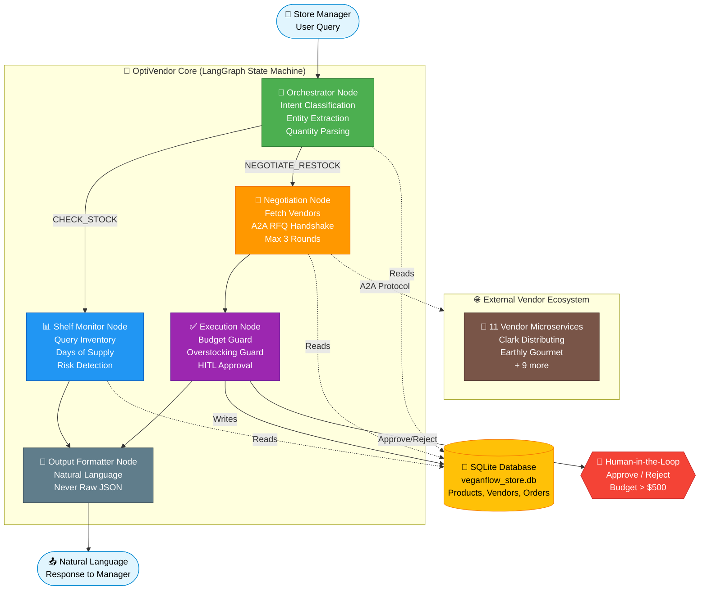

# OptiVendor
**Autonomous Multi-Agent Inventory Procurement & Negotiation System**

[](https://www.python.org/downloads/)
[](https://github.com/langchain-ai/langgraph)
[](https://ollama.ai/)
[](https://www.sqlite.org/)
[](https://streamlit.io/)
[](https://opensource.org/licenses/MIT)
[](https://opti-vendor-unkmmdjpp3udeqrsdpxqds.streamlit.app/)

An **enterprise-grade multi-agent system** that autonomously manages retail supply chain procurement — from stockout detection to vendor negotiation to safe order execution with human approval.

### Engineering Highlights

- 🤖 **Multi-Agent Orchestration** via LangGraph state machine (5 specialized agents)
- 🛡️ **Deterministic Guardrails** — Budget, Overstocking, Loop guards enforced in Python code (not LLM prompts)
- 👤 **Human-in-the-Loop Approval** — Manager approves orders > $500 before execution
- 💬 **Agent-to-Agent (A2A) Negotiation** — Autonomous multi-round vendor price negotiation
- 📋 **Full Audit Trail** — Every decision logged to `approval_log.txt` for compliance
- 🔒 **Layered Defense** — Multiple independent safety checks prevent failures

**Tech:** `Python` · `LangGraph` · `Ollama (qwen2.5:7b)` · `SQLite` · `Streamlit` · `Pandas`

🔗 **[Live Demo →](https://opti-vendor-unkmmdjpp3udeqrsdpxqds.streamlit.app/)**
---

## 🎬 LIVE DEMO — TRY IT NOW

**👉 [Live Application](https://opti-vendor-h9hsmnvx5xfkzxujmrvsky.streamlit.app/)**

**Try these 3 scenarios in 2 minutes:**

1. **Detect Stockout Risk** — Type: `"Check my store inventory"`
   - System identifies critical stock items
   - Shows Days of Supply calculation

2. **Small Order Auto-Execute** — Type: `"Order 50 units of Oat Barista Blend"`
   - Agent negotiates with vendor
   - Order executes automatically (< $500)
   - Total cost: $157.50

3. **Large Order With Guardrails** — Type: `"Order 500 units of Oat Barista Blend"` → Click Approve
   - Budget Guard triggers ($1,575 > $500)
   - Manager approves
   - Overstocking Guard reduces to 88 units
   - Final order: $277.20 (vs $1,575 requested)

---

## ✨ The Problem 

**Retail inventory management is broken:**
- Stockouts happen because managers react, not prevent
- Over-ordering wastes capital on perishables
- Manual spreadsheet process takes 30+ minutes per decision

**What OptiVendor does:**
- Detects risk automatically
- Negotiates with vendors autonomously
- Executes orders in **3 seconds** with safety guardrails
- Every decision logged for compliance

---

## 🎯 What You're Looking At (This Project)

A **production-grade multi-agent system** that combines:

✅ **Autonomous Agent-to-Agent Negotiation** — Claude LLM runs multi-round vendor negotiations  
✅ **Deterministic Guardrails** — Budget, overstocking, and loop limits enforced in Python code (not prompts)  
✅ **Human-in-the-Loop Approval** — Managers approve large orders (> $500) before execution  
✅ **Layered Defense** — Multiple independent safety checks prevent failures  
✅ **Full Audit Trail** — Every decision logged to `approval_log.txt`  

---

## 📊 Live Testing Evidence (9 Screenshots)

**All scenarios have been validated with screenshots below.**

### Test 1: Specific Product Query ✅


**What You See:** System queries "Vegan Jumbo Shrimp" and returns 5 units in stock, 1 unit/day velocity, OPTIMAL status.  
**Why It Matters:** Entity extraction works correctly — agent understands what product you're asking about.

---

### Test 2: Proactive Risk Detection ✅


**What You See:** When asked "Check inventory," system identifies Oat Barista Blend as critical (0.8 days remaining).  
**Why It Matters:** Agent thinks beyond literal query — proactively identifies risks before you ask.

---

### Test 3: Waste Prevention ✅


**What You See:** System identifies 3 items expiring soon with exact dates.  
**Why It Matters:** Prevents waste and capital blockage — money saved by not buying about-to-expire stock.

---

### Test 4: Small Order Auto-Execute ✅


**What You See:**
- Query: "Order 50 units of Oat Barista Blend"
- Agent negotiates: $3.15/unit
- Total: $157.50 (< $500 budget)
- Status: EXECUTED AUTOMATICALLY

**Why It Matters:** Low-risk orders execute instantly. No waiting for approval. No manual intervention.

---

### Test 5: Overstocking Guard ✅


**What You See:**
- Requested: 50 units of Almond Milk
- Actual Ordered: 15 units
- Reason: Target (60) - Current (45) = 15 max available

**Why It Matters:** Even if you request too much, system prevents waste. Protects capital. Hits exact target stock.

---

### Test 6: Budget Guard Trigger ✅


**What You See:**
- Query: "Order 200 units of Cultured Truffle Brie"
- Original Cost: $1,656 (200 × $8.28)
- Budget Threshold: $500
- Result: APPROVAL CARD SHOWN (order paused)

**Why It Matters:** Large financial decisions require human review. System enforces business rule automatically.

---

### Test 7: Approval Flow ✅


**What You See:**
- Manager clicks ✅ APPROVE
- System applies Overstocking Guard
- Requested 200 → Executed 22 units
- Total Cost: $182.16 (vs $1,656 requested)

**Why It Matters:** LAYERED DEFENSE — Even after approval, second guard prevents over-ordering.

---

### Test 8: Rejection Flow ✅


**What You See:**
- Manager clicks ❌ REJECT
- Order cancelled
- Audit log entry created

**Why It Matters:** Manager can override agent. Full control. Full transparency.

---

### Test 9: Layered Defense in Action ✅


**What You See:**
- Query: "Order 500 units of Oat Barista Blend"
- Original Value: $1,575
- Budget Guard: Paused for approval
- Manager Approves
- Overstocking Guard: Reduces 500 → 88 units
- Final Executed: 88 units @ $3.15 = $277.20

**Why It Matters:** THIS IS THE CORE MAGIC — Two guardrails fire in sequence independently.

---


## 🏗️ System Architecture




---

## 🛡️ The Three Guardrails (The Secret Sauce)

All three are **Python code, not LLM prompts.** This means they ALWAYS work, no exceptions.

### Guard 1: Loop Guard
```
Rule: Maximum 3 negotiation rounds per query
Location: agents.py → negotiation_node()
Why: Prevents infinite loops, controls token cost
```

### Guard 2: Budget Guard
```
Rule: Orders > $500 require human approval
Location: agents.py → execution_node()
Why: Prevents large autonomous financial decisions
Key Detail: Checks ORIGINAL value, not reduced value
           (So manager sees true scope)
```

### Guard 3: Overstocking Guard
```
Rule: Order quantity capped at (Target - Current)
Location: tools.py → execute_order()
Why: Prevents over-ordering, capital blockage, waste
```

### How They Work Together

```
SCENARIO: Order 500 units @ $3.15 = $1,575

Step 1 — Budget Guard fires
├─ $1,575 > $500
└─ Result: PAUSE for human approval

Step 2 — Manager approves
└─ Result: PROCEED

Step 3 — Overstocking Guard fires
├─ Available capacity = Target (100) - Current (12) = 88
└─ Result: Reduce quantity from 500 to 88 units

Step 4 — Execute
├─ Final quantity: 88 units
├─ Final cost: 88 × $3.15 = $277.20
├─ New stock level: 100 units (target hit exactly)
└─ Audit log entry: Created ✓
```

---

## 🎬 Demo Scenarios (Quick Reference)

| Scenario | Query | What Happens | Why It Matters |
|----------|-------|--------------|----------------|
| 1 | "Check stock for Vegan Jumbo Shrimp" | Returns 5 units, OPTIMAL | Entity extraction working |
| 2 | "Check my store inventory" | Identifies critical items | Proactive risk detection |
| 3 | "Which items expiring soon?" | Lists 3 items with dates | Waste prevention |
| 4 | "Order 50 units Oat Barista" | $157.50 auto-executed | Small orders instant |
| 5 | "Order 50 units Almond Milk" | Reduced to 15 units | Guard prevents waste |
| 6 | "Order 200 units Truffle Brie" | $1,656 approval card | Large orders need approval |
| 7 | "Order 500 units Oat Barista" → Approve | 500 → 88 units executed | Both guards work together |

---

## 🖥️ The Application (3 Tabs)

### Tab 1: Live Visual War Room
Real-time animation of the entire procurement pipeline:
- Step 1: Inventory scan
- Step 2: Memory load
- Step 3: Vendor discovery
- Step 4: Negotiation handshake
- Step 5: Atomic execution

### Tab 2: Chat Terminal
Natural language interface with:
- Live tool traces
- Approval cards (when needed)
- Chat history
- Sidebar demo buttons (1-click scenarios)

### Tab 3: Live Inventory Database
Real-time SQLite view with:
- Current stock levels
- Days of Supply
- Health status (CRITICAL/LOW/OPTIMAL)
- Color-coded alerts
- Live updates after each order

---

## 💡 Key Design Decisions (Why This Works)

### Decision 1: Guardrails in Code, Not Prompts
```
Wrong approach:
  "Please never spend more than $500"
  ↓ (LLM can ignore this)

Right approach:
  if order_cost > 500:
      requires_approval = True
  ↓ (Code always enforces)
```

### Decision 2: Check Original Value, Not Reduced Value
```
Request: 500 units @ $3.15 = $1,575

Wrong way:
  └─ Reduce to 88 units first
  └─ Check: 88 × $3.15 = $277 < $500
  └─ Execute automatically (manager never sees $1,575)

Right way:
  └─ Check original: $1,575 > $500
  └─ Pause for approval (manager sees true scope)
  └─ After approval, reduce to 88 units
```

### Decision 3: Layered Defense
Multiple independent guards catch different failure modes:
- Guard 1 stops large unauthorized orders
- Guard 2 confirms with human
- Guard 3 prevents physical overstocking

### Decision 4: Audit Everything
Every approval, rejection, and execution logged to `approval_log.txt`:
```
2026-09-26 20:45:12 | APPROVED | Oat Barista | 500 → 88 units | $277.20
2026-09-26 20:50:30 | REJECTED | Truffle Brie | 200 units | $1,656
```

---

## 📦 Installation 

```bash
# 1. Clone
git clone https://github.com/rupali-chauksey/SupplyChain.git
cd SupplyChain

# 2. Virtual environment
python -m venv venv
source venv/bin/activate        # macOS/Linux
# venv\Scripts\activate         # Windows

# 3. Install
pip install -r requirements.txt

# 4. Get LLM models (if using Ollama locally)
ollama pull qwen2.5:7b
ollama pull llama3.2

# 5. Initialize database
python database.py

# 6. Run
streamlit run app.py
```

**Open:** `http://localhost:8501`

---

## 🚀 Tech Stack

| Component | Technology |
|-----------|-----------|
| Orchestration | LangGraph StateGraph |
| LLM | Ollama (qwen2.5:7b, llama3.2) |
| Database | SQLite |
| Frontend | Streamlit |
| Data | Pandas |
| Language | Python 3.10+ |

---

## 📁 Project Structure

```
optivendor/
├── app.py                      # Streamlit UI
├── agents.py                   # LangGraph state machine
├── tools.py                    # Database + utilities
├── database.py                 # SQLite schema
├── requirements.txt            # Dependencies
├── README.md                   # You are here
├── agent_trace.log             # Auto-generated logs
├── approval_log.txt            # Approval audit trail
├── veganflow_store.db          # SQLite database
└── screenshots/                # 9 test screenshots
```

---

## 🧪 Testing

```bash
# Manual: Use sidebar demo buttons in app

# Automated:
python evals.py                           # 6 test cases
python test_inventory_guardrails.py       # Unit tests
```

---

## 📝 License

MIT License — See LICENSE file

---


**Repository:** [github.com/rupali-chauksey/OptiVendor](https://github.com/rupali-chauksey/OptiVendor)


